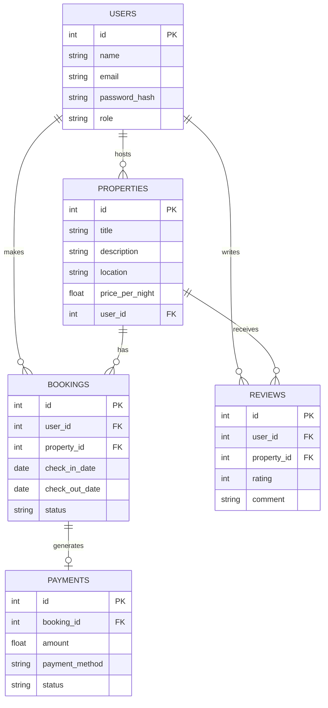

# Airbnb Clone

## Overview
The Airbnb Clone Project is a full-stack application that simulates a real booking platform. It emphasizes backend systems, database design, API development, and security, giving learners hands-on experience with scalable architectures and team collaboration.

## Team Roles
- **Backend Developer**: Responsible for the server-side logic, database design, and API development.
- **Frontend Developer**: Handles the user interface and user experience.
- **Database Administrator**: Manages the database and ensures data integrity.
- **DevOps Engineer**: Sets up and manages deployment pipelines, CI/CD processes, and cloud infrastructure.
- **QA Engineer (Tester)**: Ensures software quality by writing and executing test cases, identifying bugs, and validating that features work as intended
- **Project Manager**: Oversees the project timeline, coordinates collaboration between roles, and ensures goals are met
- **UI/UX Designer**:Crafts intuitive and appealing user experiences, designs wireframes, and ensures accessibility and consistency across the application.
## Technology Stack
- **Django**: A high-level Python web framework used to build RESTful APIs.
- **Django REST Framework (DRF)**: An extension of Django for building powerful RESTful APIs
- **PostgreSQL**: A relational database system for structured data storage and queries.
- **Redis**: An in-memory data store used for caching and managing background task queues.
- **GraphQL**: A query language for APIs that allows clients to request exactly the data they
- **Celery**: A distributed task queue for handling asynchronous and scheduled jobs.

- **Docker**: A containerization platform that simplifies deployment and ensures consistency across environments.

- **CI/CD Pipelines**: Automated workflows for testing, building, and deploying code, ensuring reliable and efficient delivery.

## Database Design
The project database is structured to support a booking platform similar to Airbnb. Below are the key entities, their important fields, and relationships:

## Entity Relationship Diagram (ERD)

## Feature Breakdown

### **1. User Management**
Handles user registration, authentication, and role management (guest, host, admin). This feature ensures secure access, personalized experiences, and role-based permissions across the platform.
### **2. Property Management**
Allows hosts to list, update, and manage properties with details such as location, price, and availability. This enables a rich catalog of accommodations for users to browse and book.
### **3. Booking System**
Provides guests with the ability to search for properties, check availability, and make reservations. It manages booking statuses (pending, confirmed, cancelled) and ensures smooth scheduling between hosts and guests.
### **4. Reviews & Ratings**
Enables guests to leave feedback and ratings on properties they have stayed in. This builds trust and transparency, helping future guests make informed decisions.
### **5. Payment Integration**
Handles secure payment processing for bookings, including multiple methods (e.g., credit card, PayPal). It ensures that transactions are reliable, traceable, and tied directly to bookings.
### **6. Notifications & Alerts**
Sends confirmations, reminders, and status updates to users via email or in-app messages. This improves user experience by keeping both guests and hosts informed.

## API Security
Security is a core aspect of this project to ensure user trust, data protection, and safe transactions. The following measures will be implemented:

1.**Authentication**

All API endpoints will be protected using JWT tokens or OAuth 2.0 to verify user identity.
Why? Ensures only verified users (guests, hosts, admins) can access the system.

2.**Authorization**

Role-Based Access Control (RBAC) will restrict users to only the actions they are permitted to perform (e.g., hosts manage properties, guests make bookings).
Why? Prevents unauthorized access to sensitive resources like property management or admin functions.

3.**Data Encryption**

All traffic will use HTTPS/TLS to secure data in transit. Sensitive fields (passwords, payment info) will be encrypted at rest.
Why? Protects user credentials, booking data, and financial transactions from being intercepted or stolen.

4.**Input Validation & Sanitization**

All incoming requests will be validated (type, length, format) to prevent malicious payloads.
Why? Defends against common vulnerabilities such as SQL Injection and Cross-Site Scripting (XSS).

5.**Logging & Monitoring**

API access logs and error tracking will be enabled to monitor unusual activities and security threats.
Why? Allows early detection of suspicious behavior and supports auditing in case of breaches.

6.**Rate Limiting**

The API will enforce limits on the number of requests per user/IP within a time frame.
Why? Protects against brute-force attacks, denial-of-service (DoS), and abuse of resources.
